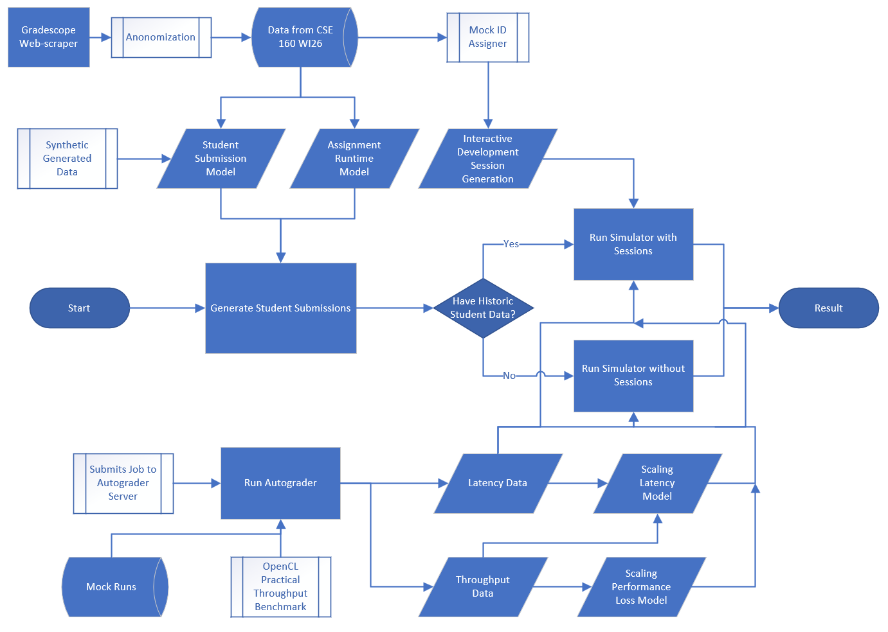

# Junkyard Autograder Bench

Junkyard Benchmarking for CSE 145/237D

Overview:
The Junkyard project aims to repurpose old and unusable smartphones as valuable compute units for distributed computing. One of these applications is for a class of students testing their code for timing and accuracy. In the most recent offering of CSE 160, the class was allocated 40 reservable GTX 1080 Ti pods on 
DSMLP (UCSD's Data Science and Machine Learning Platform) shared across roughly 330 students. Demand routinely exceeded supply around assignment deadlines, creating bottlenecks that delayed feedback and frustrated students. Student submissions don't need raw GPU power, they need a consistently available and 
standardized execution environment. A cluster of repurposed smartphones can provide exactly that, at a fraction of the cost and with hardware that would otherwise be discarded. Smartphones are particularly well-suited for this use case: they are power-efficient, self-contained compute nodes with standardized hardware 
profiles, and their ubiquity means institutions can source them at little to no cost. Rather than competing for shared high-performance resources, students would submit to a dedicated phone cluster optimized specifically for lightweight, reproducible execution. This project investigates two core questions. First, how many 
phones are needed to serve a class of n students without meaningful queuing delays? Second, what is the throughput ceiling of a phone cluster, measured in submissions per unit time, before the system degrades under load?

# File Structure
```
junkyard-autograder-bench/
├── cluster-bench/               # Scripts and configs for benchmarking the phone cluster
│   ├── opencl/                  # OpenCL workload used in benchmarks
│   ├── qcluster/                # Qualcomm cluster deployment config
│   └── strawhat/                # Strawhat cluster deployment, submission scripts, and results
├── opencl-throughput-bench/     # Standalone OpenCL throughput benchmark
│   └── helper_lib/              # Shared OpenCL utility library
├── project-spec/                # Project specification, LaTeX writeup, and workflow diagrams
├── simulation/                  # Queueing simulation and synthetic submission data
├── submission-model/            # Pipeline for modeling and generating synthetic submissions
│   ├── cse160-data/             # Real CSE 160 data: filtered CSVs, GMM scripts, figures
│   ├── id-assigner/             # Rust CLI: anonymize students with sequential IDs
│   └── interactive-dev-sessions/ # Rust CLI: infer dev sessions from submission timestamps
└── README.md
```

## Instructions

Refer to the README files in each directory for their instructions, for a comprehensive page of instructions, see the [Wiki Tab](https://github.com/junkyard-computing/junkyard-autograder-bench/wiki) for details

## Workflow:


